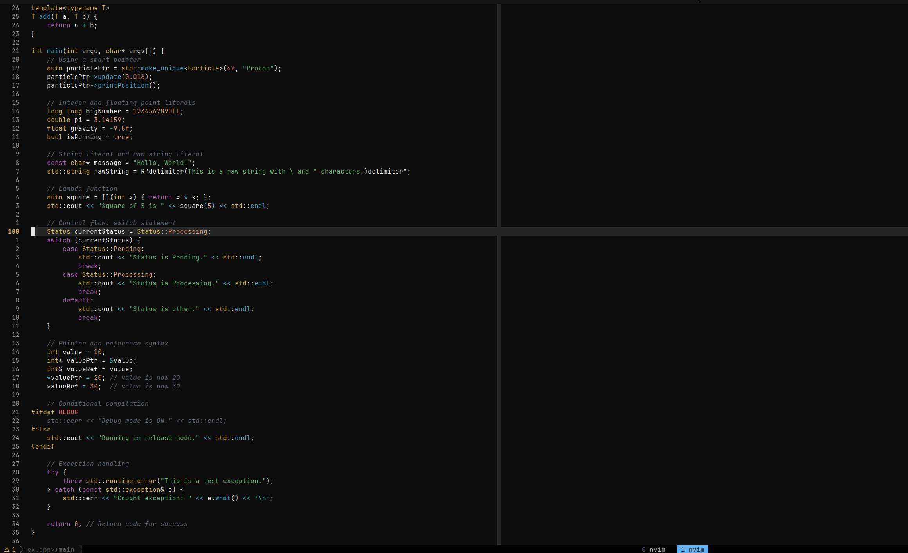
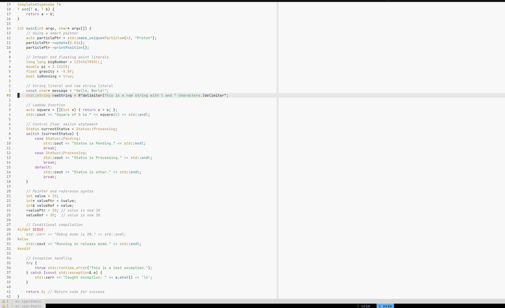

# blackbird.nvim


```
                 .         ▗▄▄▖  ▗▄▄▖          .
                //         ▐▌ ▐▌ ▐▌ ▐▌         \\
               //          ▐▛▀▚▖ ▐▛▀▚▖          \\
              //           ▐▙▄▞▘ ▐▙▄▞▘           \\
             //                _._                \\
          .---.              .//|\\.              .---.
________ / .-. \_________..-~ _.-._ ~-..________ / .-. \_________
         \ ._. /    H-     '--.___.--'     -H    \ ._. /
          •---•     H          [H]          H     •---•
                   _H_         _H_         _H_
                   UUU         UUU         UUU
```


A colorscheme for Neovim.

-   `blackbird`: A dark theme.
-   `whitebird`: A light theme.

## Screenshots

### blackbird



### whitebird



## Installation and Usage

```lua
{
    "S-Spektrum-M/blackbird.nvim",
    event = "ColorSchemePre",
    lazy = false,
    priority = 1000,
    config = function()
        -- blackbird
        vim.cmd.colorscheme("blackbird")
        -- whitebird
        vim.cmd.colorscheme("whitebird")
    end
}
```

## Plugin Support

`blackbird.nvim` currently supports the following plugins

-   Treesitter
-   LSP Diagnostics
-   GitSigns
-   Telescope
-   NvimTree
-   Which-key
